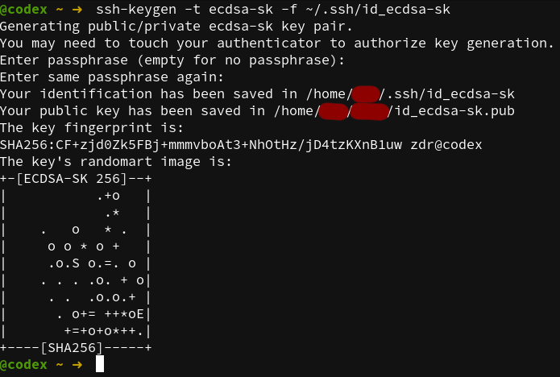

# YubiKey

You received your `YubiKey` and now you are looking how to get most from
it (like me) so i decided to write down some notes how I setup it. As I'm `Fedora`
user all my findings are related to this `Linux` distribution but can by applied
with some modification to others as well. At time of writing this, I'm using
`Fedora` version `34` and `YubiKey NEO`.

## YubiKey NEO

The `YubiKey NEO` has five distinct applications, which are all independent of
each other and can be used simultaneously.

> Note: Some software such as GPG can lock the CCID USB interface, preventing
> another software from accessing applications that use that mode.

### Interfaces
The `YubiKey NEO` has **USB 2.0** and **NFC** interfaces. All of the applications are
available through these interfaces. The NFC interface also supports `MIFARE Classic 1k.`

## Installation

You need to install some packages first.

```bash
dnf install pcsc-lite ykpers yubikey-manager yubico-piv-tool
```

Now enable and start `pcscd` service.
```bash
systemctl enable pcscd
systemctl start pcscd
```

Now check if both services (pcscd and pcscd.socket) are up and running.


### pcsc-lite
The purpose of PC/SC Lite is to provide a Windows(R) `SCard` interface
in a very small form factor for communicating to `smartcards` and
readers.  PC/SC Lite uses the same `winscard API` as used under
Windows(R).  This package includes the PC/SC Lite daemon, a resource
manager that coordinates communications with smart card readers and
smart cards that are connected to the system, as well as other command
line tools.

### ykpers
The YubiKey Personalization package contains a library and command line tool
used to personalize (i.e., set a `AES` key) `YubiKeys`.

This package also provides commands:
- [ykchalrespm](https://developers.yubico.com/yubikey-personalization/Manuals/ykchalresp.1.html)
- [ykinfo](https://developers.yubico.com/yubikey-personalization/Manuals/ykinfo.1.html)
- [ykpersonalize](https://developers.yubico.com/yubikey-personalization/Manuals/ykpersonalize.1.html)

### yubikey-manager
Python 3.6 (or later) library and command line tool for configuring a `YubiKey`.

This package provide command:
- [ykman](https://developers.yubico.com/yubikey-manager/)

Get some information about your `YubiKey`


### yubico-piv-tool
The Yubico PIV tool is used for interacting with the Privilege and Identification
Card (PIV) applet on a `YubiKey`. With it you may generate keys on the device,
importing keys and certificates, and create certificate requests, and other
operations.

This package provide command:
- [yubico-piv-tool](https://developers.yubico.com/yubico-piv-tool/YubiKey_PIV_introduction.html)


## Applications

### OTP
The OTP applet contains two programmable slots, each can hold one of the
following credentials:

- Yubico OTP
- HMAC-SHA1 Challenge-Response
- Static Password
- OATH-HOTP

`OTP` can be used as the second factor in a 2-factor authentication scheme or
on its own providing strong single factor authentication.

#### Writing a new static password to the second slot
Newer `Yubikeys` (Yubikey 2+) have the ability to store two separate configurations.
The first is generally used for OTPs, the second for a strong, static password.
If the button is pressed shortly, something up to 1.5 seconds, the first
configuration is triggered. If the button is pressed longer, in the range of
2.5 to 5 seconds, the second configuration is triggered. 

This password can be generated in `YubiKey` (complies with most password policy requirements)
or provided. The maximum length is 38 characters wihis is also default value.

> Note: the generated portion should comprise only part of your complete
> password - more specifically, the end of it. For security, prepend a password
> of your choosing to the generated password to create a "something you know"
> and "something you have" scenario.

**Example:**

generate a random static password in Yubikey's config slot 2
```bash
ykman otp static 2 --generate --length 16 --keyboard-layout US
```

set a custom password in in Yubikey's config slot 2
```bash
ykman otp static 2 P@ssw0rd1234 --keyboard-layout US
```

**Usage:**

The best usage in my opinion is to complete (See note above) password used for
password manager where you store all of your other passwors and credential
informations. Basicaly this can by used in any situation requared entering password.

---

### U2F
The `U2F` application can hold an unlimited number of `U2F credentials` and is
`FIDO certified`.

#### SSH support for Two-Factor (U2F/FIDO) tokens
Starting with `OpenSSH` version `8.2` support for U2F/FIDO tokens is included.
This means you have to explicitly authorize a new `SSH` session by tapping the
`YubiKey`. The private `SSH` key, which is normally on your `SSD` or `cloud instance`,
should be useless to a malicious user who does not have access to the physical
`YubiKey` on which the second private key is stored.

But before you should start using this you need to generate new `private key`.

As of now `ssh-keygen` support two types of key supported by `YubiKey`:
- ecdsa-sk
- ed25519-sk

The `sk` extension stands for security key.

> Note: ed25519-sk is only supported by new versions of YubiKey with firmware
> 5.2.3 or higher. You can check the version with command 'ykman info'.

In this example I'm using `ecdsa-sk` key which is not recommended because
apparently it has an `NSA` [back door](https://www.wired.com/2013/09/nsa-backdoor/)
so when you do this in real life make sure you use the `ed25519-sk` key.

```bash
ssh-keygen -t ecdsa-sk -f ~/.ssh/id_ecdsa-sk
```


---

### OATH
The `YubiKey NEO` series can hold up to 28 `OATH` credentials and supports both
`OATH-TOTP` and `OATH-HOTP` authentication.

`TOTP` (Time-based One-time Password algorithm) is a variant of the OTP authentication,
where the one-time password changes at frequent intervals (say, every 30 seconds).
Each one-time password is generated by applying a random-looking cryptographic
function to a unique series value. In the time-based case, the value is the
current time.

`HOTP` (Hmac-based One-Time Password algorithm) is a variant of OTP authentication,
where one-time password is valid for an unknown period of time. HOTP authentication
relies on a shared secret and a moving factor. Every time a new OTP is generated,
the moving factor will be incremented and as a result generated one-time
passwords should be different every time.

#### List stored accounts

If you are using your `YubiKey` for two-factor OATH authentication with
Google, Slack or Microsoft you should already have some account in it. So
to list them all use:
```bash
ykman oath accounts list
```

#### Generate code for account

To generate code from OATH for accounts stored on the `YubiKey` you need to
provide a query string to match one or more specific accounts. Accounts of
type `HOTP`, or those that require touch, require a single match to be triggered.

Generate codes for accounts starting with `Slack`:
```bash
ykman oath accounts code Slack
```

#### Add an account

You can also create your own account if needed.

Add an account, with the secret key `d7yheiow98` and the name `yubico`:
```bash
ykman oath accounts add yubico d7yheiow98
or
ykman oath accounts add yubico d7yheiow98 --touch
```

#### Set a password for the OATH application

You should set the password to protect your `OATH` accounts stored on `YubiKey`:
```bash
ykman oath access change
```

---

### PIV (Smart Card)
This application provides a `PIV` compatible smart card.

Supported Algorithms:
- RSA 1024
- RSA 2048

The `YubiKey` supports the Personal Identity Verification (PIV) card interface
specified in `NIST SP 800-73` document `Cryptographic Algorithms and Key Sizes for PIV`.
PIV enables you to perform `RSA` or `ECC` sign/decrypt operations using a private
key stored on the smartcard, through common interfaces like PKCS#11.

`YubiKey NEO` holds 4 distinct slots for certificates (`YubiKey 4 & 5` holds 24).
Each of these slots is capable of holding an X.509 certificate, together with
its accompanying private key. Technically these four slots are very similar,
but they are used for different purposes.

`YubiKey NEO` available slots:
- **9a** is for PIV Authentication (This slot is used for things like system login.)
- **9c** is for Digital Signature (This slot is used for digital signatures for the purpose of document signing, or signing files and executables.)
- **9d** is for Key Management (This slot is used for things like encrypting e-mails or files.)
- **9e** is for Card Authentication (This slot is used to support additional physical access applications, such as providing physical access to buildings via PIV-enabled door locks.)

You can read more about those slots [here](https://docs.yubico.com/yesdk/users-manual/application-piv/slots.html).

The default `PIN` code is `123456`. The default `PUK` code is `12345678`.

#### Prepare a YubiKey for real use
Before you start using this application you should change the management key to
make sure nobody but you can modify the state of the `PIV` application on the `YubiKey`.

> Note: Make sure to keep a copy of the key around for later use.

All of these commands bellow will leave traces of keys and pins in the command
line history, this can be avoided by leaving the argument out all-together
and the software will ask for key/pin to be input. In `Linux` system type a space
before a command before running it in the `Bash` shell and the command will
run normally, but won't appear in your history.

```bash
key=$(LC_CTYPE=C dd if=/dev/urandom 2>/dev/null | tr -d '[:lower:]' | tr -cd '[:xdigit:]' | fold -w48 | head -1)
echo ${key}
yubico-piv-tool -aset-mgm-key -n${key}
```

The `PIN` and `PUK` should be changed as well.
```bash
pin=$(LC_CTYPE=C dd if=/dev/urandom 2>/dev/null | tr -cd '[:digit:]' | fold -w6 | head -1)
echo ${pin}
```
```bash
puk=$(LC_CTYPE=C dd if=/dev/urandom 2>/dev/null | tr -cd '[:digit:]' | fold -w8 | head -1)
echo ${puk}
```
```bash
yubico-piv-tool -achange-pin -P123456 -N${pin}
yubico-piv-tool -achange-puk -P12345678 -N${puk}
```

**Usage:**

The best candidate for real life usage should be `OpenVPN` as already include
support for external certificates on PKCS#11 hardware tokens or `SSH`. I didn't
tried to utilise this functionality now but I will do one day.

---

### OpenPGP
This application implements version 2.0 of the [OpenPGP Smart Card specification](https://g10code.com/p-card.html)
which can be used with GnuPG.

Supported Algorithms:
- RSA 1024
- RSA 2048
