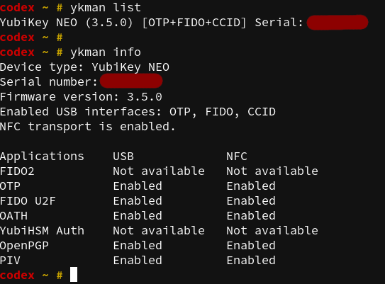

# YubiKey

You received your `YubiKey` and now you are looking how to get most from
it (like me) so i decided to write down some notes how I setup it. As I'm `Fedora`
user all my findings are related to this `Linux` distribution but can by applied
with some modification to others as well. At time of writing this, I'm using
`Fedora` version `34` and `YubiKey NEO`.

## YubiKey NEO

The `YubiKey NEO` has five distinct applications, which are all independent of
each other and can be used simultaneously.

> Note: Some software such as GPG can lock the CCID USB interface, preventing
> another software from accessing applications that use that mode.

### Interfaces
The `YubiKey NEO` has **USB 2.0** and **NFC** interfaces. All of the applications are
available through these interfaces. The NFC interface also supports `MIFARE Classic 1k.`

## Installation

You need to install some packages first to utilize all five application mentioned
above.

```bash
dnf install pcsc-lite ykpers yubikey-manager
```

Now enable and start `pcscd` service.
```bash
systemctl enable pcscd
systemctl start pcscd
```

Now check if both services (pcscd and pcscd.socket) are up and running.


### pcsc-lite
The purpose of PC/SC Lite is to provide a Windows(R) `SCard` interface
in a very small form factor for communicating to `smartcards` and
readers.  PC/SC Lite uses the same `winscard API` as used under
Windows(R).  This package includes the PC/SC Lite daemon, a resource
manager that coordinates communications with smart card readers and
smart cards that are connected to the system, as well as other command
line tools.

### ykpers
The YubiKey Personalization package contains a library and command line tool
used to personalize (i.e., set a `AES` key) `YubiKeys`.

This package also provides commands:
- [ykchalrespm](https://developers.yubico.com/yubikey-personalization/Manuals/ykchalresp.1.html)
- [ykinfo](https://developers.yubico.com/yubikey-personalization/Manuals/ykinfo.1.html)
- [ykpersonalize](https://developers.yubico.com/yubikey-personalization/Manuals/ykpersonalize.1.html)

### yubikey-manager
Python 3.6 (or later) library and command line tool for configuring a `YubiKey`.

This package provide command:
- [ykman](https://developers.yubico.com/yubikey-manager/)

Get some information about your `YubiKey`



## Aplications

### OTP
The OTP applet contains two programmable slots, each can hold one of the
following credentials:

- Yubico OTP
- HMAC-SHA1 Challenge-Response
- Static Password
- OATH-HOTP

`OTP` can be used as the second factor in a 2-factor authentication scheme or
on its own providing strong single factor authentication.

*USB Interface: OTP*

#### Writing a new password to the second slot
Newer `Yubikeys` (Yubikey 2+) have the ability to store two separate configurations.
The first is generally used for OTPs, the second for a strong, static password.
If the button is pressed shortly, something up to 1.5 seconds, the first
configuration is triggered. If the button is pressed longer, in the range of
2.5 to 5 seconds, the second configuration is triggered. 

This password can be generated in `YubiKey` (complies with most password policy requirements)
or provided. The maximum length is 38 characters wihis is also default value.

> Note: the generated portion should comprise only part of your complete
> password - more specifically, the end of it. For security, prepend a password
> of your choosing to the generated password to create a "something you know"
> and "something you have" scenario.

**Example:**

generate a random static password in Yubikey's config slot 2
```bash
ykman otp static 2 --generate --length 16 --keyboard-layout US
```

set a custom password in in Yubikey's config slot 2
```bash
ykman otp static 2 P@ssw0rd1234 --keyboard-layout US
```

**Usage:**

The best usage in my opinion is to complete (See note above) password used for
password manager where you store all of your other passwors and credential
informations. Basicaly this can by used in any situation requared entering password.

---

### U2F
The `U2F` application can hold an unlimited number of `U2F credentials` and is
`FIDO certified`.

*USB Interface: FIDO*

#### SSH support for Two-Factor (U2F/FIDO) tokens
Starting with `OpenSSH` version `8.2` support for U2F/FIDO tokens is included.
This means you have to explicitly authorize a new `SSH` session by tapping the
`YubiKey`. The private `SSH` key, which is normally on your `SSD` or `cloud instance`,
should be useless to a malicious user who does not have access to the physical
`YubiKey` on which the second private key is stored.

But before you should start using this you need to generate new `private key`.

As of now `ssh-keygen` support two types of key supported by `YubiKey`:
- ecdsa-sk
- ed25519-sk

The `sk` extension stands for security key.

> Note: ed25519-sk is only supported by new versions of YubiKey with firmware
> 5.2.3 or higher. You can check the version with command 'ykman info'.

In this example I'm using `ecdsa-sk` key which is not recommended because
apparently it has an `NSA` [back door](https://www.wired.com/2013/09/nsa-backdoor/)
so when you do this in real life make sure you use the `ed25519-sk` key.

```bash
ssh-keygen -t ecdsa-sk -f ~/.ssh/id_ecdsa-sk
```


---

### OATH
The `YubiKey NEO` series can hold up to 28 `OATH` credentials and supports both
`OATH-TOTP` (time based) and `OATH-HOTP` (counter based).

*USB Interface: CCID*

---

### PIV (Smart Card)
This application provides a `PIV` compatible smart card.

Supported Algorithms:
- RSA 1024
- RSA 2048

*USB Interface: CCID*

---

### OpenPGP
This application implements version 2.0 of the [OpenPGP Smart Card specification](https://g10code.com/p-card.html)
which can be used with GnuPG.

Supported Algorithms:
- RSA 1024
- RSA 2048

*USB Interface: CCID*


