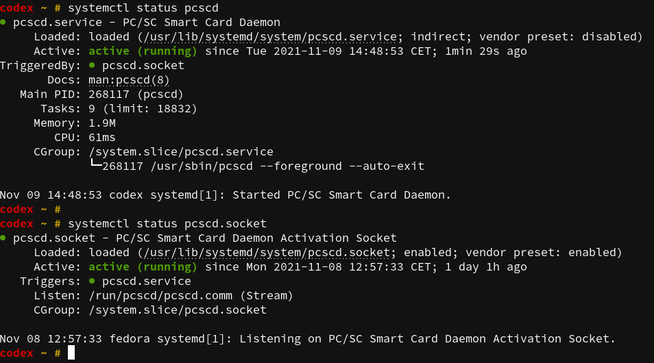

# YubiKey

You received your `YubiKey` and now you are looking how to get most from
it (like me) so i decided to write down some notes how I setup it. As I'm `Fedora`
user all my findings are related to this `Linux` distribution but can by applied
with some modification to others as well. At time of writing this, I'm using
`Fedora` version `34` and `YubiKey NEO`.

## YubiKey NEO

The `YubiKey NEO` has five distinct applications, which are all independent of
each other and can be used simultaneously.

> Note: Some software such as GPG can lock the CCID USB interface, preventing
> another software from accessing applications that use that mode.

### Interfaces
The `YubiKey NEO` has **USB 2.0** and **NFC** interfaces. All of the applications are
available through these interfaces. The NFC interface also supports `MIFARE Classic 1k.`

### Aplications

#### OTP
The OTP applet contains two programmable slots, each can hold one of the
following credentials:

- Yubico OTP
- HMAC-SHA1 Challenge-Response
- Static Password
- OATH-HOTP

*USB Interface: OTP*

#### U2F
The `U2F` application can hold an unlimited number of `U2F credentials` and is
`FIDO certified`.

*USB Interface: FIDO*

#### OATH
The `YubiKey NEO` series can hold up to 28 `OATH` credentials and supports both
`OATH-TOTP` (time based) and `OATH-HOTP` (counter based).

*USB Interface: CCID*

#### PIV (Smart Card)
This application provides a `PIV` compatible smart card.

Supported Algorithms:
- RSA 1024
- RSA 2048

*USB Interface: CCID*

#### OpenPGP
This application implements version 2.0 of the [OpenPGP Smart Card specification](https://g10code.com/p-card.html)
which can be used with GnuPG.

Supported Algorithms:
- RSA 1024
- RSA 2048

*USB Interface: CCID*

## Installation

You need to install some packages first to utilize all five application mentioned
above.

```bash
dnf install pcsc-lite ykpers yubikey-manager
```

Now enable and start `pcscd` service.
```bash
systemctl enable pcscd
systemctl start pcscd
```

Now check if both services (pcscd and pcscd.socket) are up and running.



### pcsc-lite
The purpose of PC/SC Lite is to provide a Windows(R) `SCard` interface
in a very small form factor for communicating to `smartcards` and
readers.  PC/SC Lite uses the same `winscard API` as used under
Windows(R).  This package includes the PC/SC Lite daemon, a resource
manager that coordinates communications with smart card readers and
smart cards that are connected to the system, as well as other command
line tools.

### ykpers
The YubiKey Personalization package contains a library and command line tool
used to personalize (i.e., set a `AES` key) `YubiKeys`.

This package also provides commands:
- [ykchalrespm](https://developers.yubico.com/yubikey-personalization/Manuals/ykchalresp.1.html),
- [ykinfo](https://developers.yubico.com/yubikey-personalization/Manuals/ykinfo.1.html)
- [ykpersonalize](https://developers.yubico.com/yubikey-personalization/Manuals/ykpersonalize.1.html)

### ykpers
Python 3.6 (or later) library and command line tool for configuring a `YubiKey`.

This package provide command:
- [ykman](https://developers.yubico.com/yubikey-manager/)
